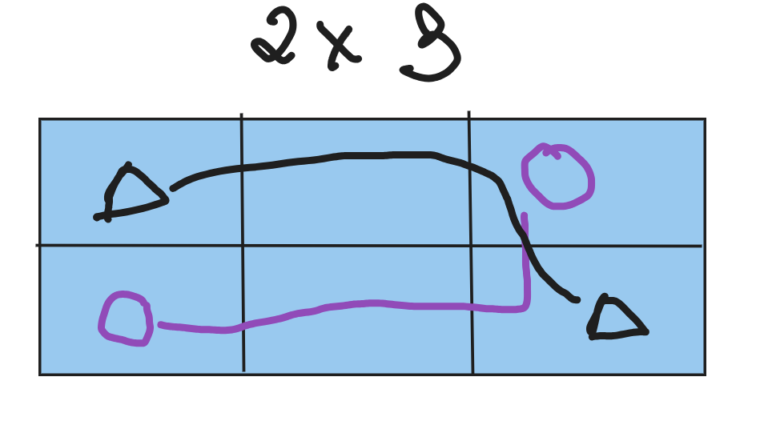
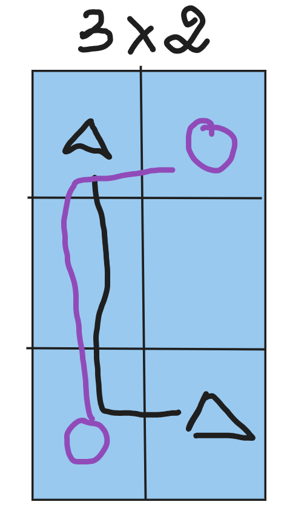

# EDITORIAL
## Core idea
**`Số cách thỏa = Tổng số cách xếp - Số cách xếp không thỏa`**

### **Số cách xếp không thỏa?**

 

*Cả 2 trường hợp trên đều có 2 trường hợp không thỏa*

### **Có bao nhiêu ô 2x3 và 3x2 trong grid n x n?**

 Ans: 

$$ 
2(n-1)(n-2)
$$

==> **Số ô không thỏa**: 

$$
4(n-1)(n-2)
$$

### Đáp án cuối cùng:

 Nhấn để xem: 

$$
 -4(n-1)(n-2)
$$

## Time & Space complexity
**Time:** O(1)  
**Space:** O(1)
 